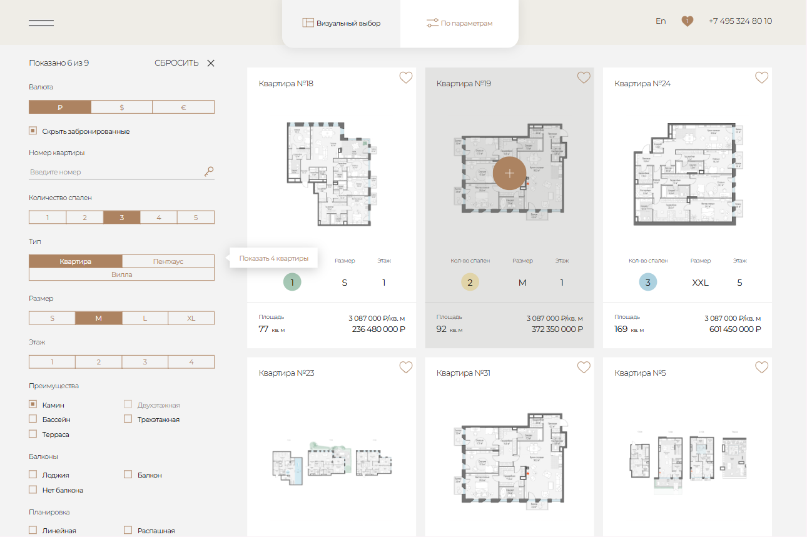

# Real Estate Filter UI – Desktop Interface

A desktop-optimized interface for filtering premium apartments, built with semantic HTML and advanced CSS techniques.

## 🚀 Live Demo  
**[View the live interface here](https://kseniiasad.github.io/Layout-of-the-apartment-selection-page-for-the-website-Obydensky-No.-1-/)**

## 📸 Preview  

## 🛠️ Technologies Used  
- **HTML5** (semantic markup, accessibility, form elements)  
- **CSS3** (CSS Grid, Flexbox, BEM methodology)  
- **Desktop-First** approach  
- **Git & GitHub Pages** (deployment)

## ✨ Key Features  
- **Complex Filter System** – 11 interactive filter categories with visual feedback  
- **Semantic Structure** – proper use of `<fieldset>`, `<article>`, `<section>`  
- **CSS Grid Layout** – advanced grid for filters and apartment cards  
- **Pure CSS Interactivity** – hover, active, and focus states without JavaScript  
- **Accessibility-First** – proper labels, keyboard navigation, screen reader support  
- **Visual Consistency** – cohesive design system with consistent spacing and typography

## 🖥️ Viewport Optimization  
- **Desktop:** Optimized for 1440px and above  
- **Interface designed for real estate professionals** who work on large screens  

## 📁 Project Structure  
Layout-of-the-apartment-selection-page-for-the-website-Obydensky-No.-1-/
├── index.html
├── css/
│ └── style.css
├── fonts/
├── images/
│ └── preview.png
└── README.md

## 📬 Contact  
[My GitHub Profile](https://github.com/KseniiaSad)
